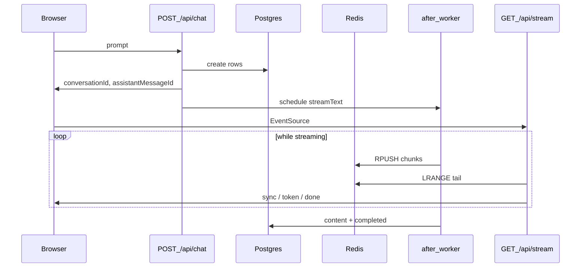

# AI Chat (durable streaming)

Next.js 16 app for chat with **durable streaming**, **multi-tab sync**, and **Postgres-backed** conversations. The assistant uses the **Vercel AI SDK** (`streamText`) with **OpenRouter**. Tokens are buffered in **Upstash Redis** lists; the UI follows progress over **Server-Sent Events (SSE)**. Message bodies render as **Markdown** (GitHub-flavored via `remark-gfm`), including while streaming.

**Stack:** React 19, Prisma 7 + `@prisma/adapter-pg`, Zustand for live stream text in the client, React Hook Form + Zod for forms, shadcn-style UI under `shared/ui/` (Tailwind CSS 4).

---

## Prerequisites

- [Node.js](https://nodejs.org/) (version compatible with Next.js 16)
- [pnpm](https://pnpm.io/) — this repo uses `pnpm-lock.yaml`
- [mise](https://mise.jdx.dev/) (optional but recommended; project rules use `mise x --` for commands)
- **PostgreSQL** (e.g. Neon) and an **Upstash Redis** database with the REST API enabled
- **OpenRouter** API key

---

## Setup

1. **Clone and install**

   ```bash
   cd ai_chat
   pnpm install
   ```

2. **Environment** — copy or create `.env` (see [Environment variables](#environment-variables) below).

3. **Database schema**

   ```bash
   pnpm prisma migrate dev
   ```

   For production deploys:

   ```bash
   pnpm prisma migrate deploy
   ```

   Prisma Client is generated to [`app/generated/prisma`](app/generated/prisma) (see `generator output` in `prisma/schema.prisma`).

4. **Run the dev server**

   ```bash
   pnpm dev
   ```

   Open [http://localhost:3000](http://localhost:3000). Start a conversation from **New chat**; you are redirected to `/chat/[id]` while the assistant streams.

5. **Production build** (optional check)

   ```bash
   pnpm build
   pnpm start
   ```

Other scripts: `pnpm lint`, `pnpm format` (Prettier).

---

## Environment variables

| Variable                   | Required | Description                                                                          |
| -------------------------- | -------- | ------------------------------------------------------------------------------------ |
| `DATABASE_URL`             | Yes      | PostgreSQL connection string (used by Prisma and `pg`).                              |
| `UPSTASH_REDIS_REST_URL`   | Yes      | Upstash Redis REST URL.                                                              |
| `UPSTASH_REDIS_REST_TOKEN` | Yes      | Upstash Redis REST token.                                                            |
| `OPENROUTER_API_KEY`       | Yes      | OpenRouter API key for the AI SDK provider.                                          |
| `OPENROUTER_MODEL`         | No       | Model id (e.g. `openai/gpt-4o-mini`). Defaults in [`lib/ai.ts`](lib/ai.ts) if unset. |

Prisma reads `DATABASE_URL` via [`prisma.config.ts`](prisma.config.ts).

Do not commit real secrets; keep them in `.env` (already gitignored).

---

## UI behavior

- **Home (`/`)** — form to start a conversation; first message creates rows and navigates to the chat route.
- **Chat (`/chat/[id]`)** — scrollable thread, compose area, SSE subscription when an assistant message is `streaming`. Sidebar lists conversations (from server data).
- **Markdown** — user and assistant bubbles use [`app/(app)/chat/[id]/chat-markdown.tsx`](app/(app)/chat/[id]/chat-markdown.tsx) (`react-markdown` + `remark-gfm`). Raw HTML from the model is not rendered as HTML (no `rehype-raw`).
- **Loading** — route-level loading UI and chat skeletons while data resolves.

---

## Durable streaming (how it works)

### Principles

1. **Postgres is the source of truth** for conversations and messages. Each new assistant reply is inserted immediately with `status: streaming` and empty `content`, then updated to `completed` (or `failed`) when generation finishes.

2. **Redis lists are the durable stream buffer** for in-flight text. Key pattern:

   `stream:conversation:{conversationId}:message:{messageId}`

   The server **`RPUSH`**es each chunk from `streamText()`’s `textStream`. After success, the list may be deleted; the final string is always persisted from `result.text`.

3. **Exactly one LLM run per assistant message.** `POST /api/chat` persists rows, returns ids, then schedules generation with Next.js **`after()`** in [`app/api/chat/route.ts`](app/api/chat/route.ts). The worker lives in [`lib/stream-assistant.ts`](lib/stream-assistant.ts).

4. **`GET /api/stream` does not call the model.** It only validates the message, sends an initial **`sync`** event (full text from Redis, or DB if already finished), then polls Redis for new list elements and emits **`token`** events until Postgres shows the message is no longer `streaming`, then sends **`done`**. Any number of tabs can open the same URL; they all read the same Redis list—no in-memory-only fan-out.

5. **Refresh / reconnect.** After reload, the page loads messages from Postgres, sees `streaming`, opens SSE again, receives **`sync`** with everything Redis already has, then **`token`** for new chunks until **`done`**.

### Request flow (short)



### Limits and operations

- **SSE polling interval** (~100 ms in code) trades latency vs Redis REST usage; tune in [`app/api/stream/route.ts`](app/api/stream/route.ts) if needed.
- **Route `maxDuration`** is set to **300** seconds on chat and stream routes for long generations; align with your host’s limits.
- If generation crashes mid-stream, the row can remain `streaming`; Redis may still hold partial output. A future “retry” flow should add a **new** assistant message rather than overwriting a failed one.

---

## Project layout (high level)

| Path                                      | Role                                                                 |
| ----------------------------------------- | -------------------------------------------------------------------- |
| `app/api/chat/route.ts`                   | Create or continue a conversation; schedule `after()` worker.        |
| `app/api/stream/route.ts`                 | SSE: sync, token tailing, done.                                      |
| `lib/stream-assistant.ts`                 | `streamText`, Redis append, DB finalize.                             |
| `lib/redis.ts`                            | Redis list helpers.                                                  |
| `lib/ai.ts`                               | OpenRouter model factory.                                            |
| `lib/prisma.ts`                           | Prisma client (with `pg` adapter).                                   |
| `lib/data.ts`                             | Server helpers for listing conversations / loading chat payload.     |
| `lib/types.ts`                            | Shared DTO types for UI and data layer.                              |
| `prisma/schema.prisma`                    | `Conversation`, `Message` (roles, statuses).                         |
| `app/(app)/`                              | App shell, sidebar, home, chat routes.                               |
| `app/(app)/chat/[id]/chat-room.tsx`       | Thread, SSE client, compose form, streaming state.                   |
| `app/(app)/chat/[id]/chat-markdown.tsx`   | Markdown rendering for message bodies.                               |
| `store/chat-store.ts`                     | Live streaming text in the UI (Zustand).                             |
| `shared/ui/`                              | shadcn-style UI components.                                          |

---
